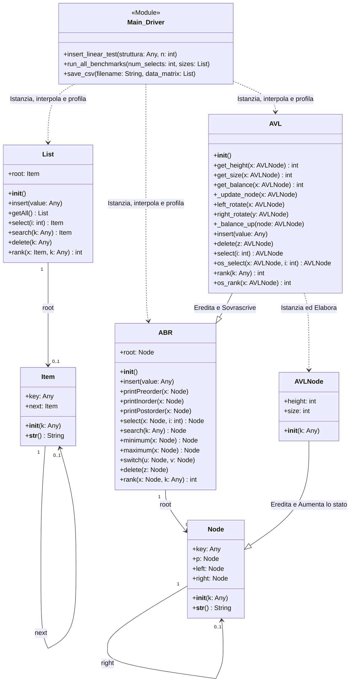

# Report utilizzo AI

**Autore:** Andrea Petrucci  
**Matricola:** 7050922  
**Data:** 24 Maggio 2026


## Informazioni sul Modello AI
Lo sviluppo del primo esercizio è stato condotto con il supporto di *Gemini* con il modello `gemini-3.5-flash` e `gemini-3.5-pro`. È stata fatta una revisione del codice tramite copilot.
Lo sviluppo del secondo esercizio è stato condotto sfruttando l'agente integrato in *Trae IDE*, selezionando come LLM il modello `GPT-5.2`.

---

# Esercizio 1: Statistiche d'Ordine Dinamiche

## 1. Funzioni di Supporto: build_structures e measure_time

**Domanda:**  
Sulla base delle strutture dati presenti in “structures.py” scrivi le funzioni:
- `build_structures(n)`: Una funzione che popola le tre strutture con lo stesso set di n numeri casuali.
- `measure_time(func, *args)`: Un wrapper che usa la libreria time per misurare quanti microsecondi impiega ogni struttura a eseguire la stessa select(i).`

**Risposta:**  
Ecco il codice per le funzioni `build_structures(n)` e `measure_time(func, *args)`. Come richiesto, ho scritto il codice, le variabili e i commenti interni completamente in inglese, mantenendo lo standard professionale tipico dei progetti di algoritmi.

Queste funzioni vanno inserite nel tuo `main.py` per orchestrare gli esperimenti. Ho utilizzato `random.sample` per garantire che i numeri inseriti siano unici (evitando duplicati che potrebbero complicare inutilmente l'albero) e `time.perf_counter()` che è il metodo più preciso in Python per misurare i microsecondi.

**Codice generato:**
```python
import time
import random
# Make sure to import your classes from structures.py
# from structures import List, ABR, AugmentedABR 

def build_structures(n):
    """
    Creates and populates the data structures with 'n' random unique integers.
    
    Args:
        n (int): The number of elements to insert.
        
    Returns:
        tuple: A tuple containing the populated List, standard BST, and 
               the original array of generated data.
    """
    # Generate 'n' unique random integers. 
    # The range is expanded (1 to n * 10) to easily allow for unique values.
    random_data = random.sample(range(1, n * 10 + 1), n)
    
    # Initialize the empty data structures
    linked_list = List()
    standard_bst = ABR()
    # augmented_bst = AugmentedABR() # Uncomment when the 3rd structure is ready
    
    # Populate the structures
    for value in random_data:
        # Note: Depending on your implementation, you might pass Item(value)/Node(value)
        # or just the integer 'value' if your insert method handles the object creation.
        linked_list.insert(value)
        standard_bst.insert(value)
        # augmented_bst.insert(value)
        
    return linked_list, standard_bst, random_data

def measure_time(func, *args):
    """
    Measures the exact execution time of a given function.
    
    Args:
        func (callable): The function/method to measure.
        *args: Variable length argument list to pass to the function.
        
    Returns:
        tuple: (execution_time_in_seconds, result_of_the_function)
    """
    start_time = time.perf_counter()
    result = func(*args)
    end_time = time.perf_counter()
    
    execution_time = end_time - start_time
    
    return execution_time, result
```

### Come utilizzarle nel tuo flusso di lavoro

Ora che hai questi due strumenti, il tuo `main.py` per testare la statistica d'ordine (ad esempio, cercare l'elemento mediano) assumerà questa forma molto pulita e analitica:

```python
# Esempio di utilizzo
if __name__ == "__main__":
    n_elements = 1000
    print(f"Building structures with {n_elements} elements...")
    
    # 1. Costruisci le strutture
    my_list, my_bst, raw_data = build_structures(n_elements)
    
    # Vogliamo cercare l'elemento a metà (la mediana)
    i_th_element = n_elements // 2 
    
    # 2. Misura il tempo per la Linked List
    list_time, list_result = measure_time(my_list.select, i_th_element)
    print(f"Linked List select time: {list_time:.6f} seconds. Result: {list_result}")
    
    # 3. Misura il tempo per l'ABR Standard
    bst_time, bst_result = measure_time(my_bst.select, i_th_element)
    print(f"Standard BST select time: {bst_time:.6f} seconds. Result: {bst_result}")
```

Usando `time.perf_counter()`, il tempo misurato sarà estremamente accurato, permettendoti di notare chiaramente la differenza di prestazioni al crescere di `n`.

---


## 2. Struttura AVL a partire da ABR

**Domanda:**  
`[mio codice dell'ABR] Sulla base di questo codice estendi la classe ABR e scrivi la struttura per un AVL`

**Risposta:**  
Per trasformare il tuo ABR in un albero **AVL**, devi introdurre il concetto di bilanciamento. A differenza del tuo ABR standard, un AVL si assicura matematicamente che l'altezza dei sottoalberi destro e sinistro di ogni nodo differisca al massimo di 1.

Per farlo mantenendo la logica iterativa e i puntatori al padre (`p`) che hai già scritto, occorrono tre modifiche principali:

1. Aggiungere un attributo `height` al nodo.
2. Implementare le funzioni di **rotazione** (Destra e Sinistra) che modificano i puntatori senza rompere l'ordine di ricerca.
3. Aggiungere un ciclo di "risalita" nell'inserimento (e cancellazione) che aggiorna le altezze e applica le rotazioni se necessario.

Ecco la struttura completa e adattata al tuo stile di codice:

### 1. La classe `AVLNode`

Nasce con un'altezza pari a 1, poiché un nodo appena inserito è sempre una foglia.

```python
class AVLNode:
    def __init__(self, k):
        self.key = k
        self.p = None
        self.left = None
        self.right = None
        self.height = 1  # L'altezza è fondamentale per l'AVL
        
    def __str__(self):
        return str(self.key)
```

### 2. La classe `AVL` con Rotazioni e Inserimento

```python
class AVL:
    def __init__(self): 
        self.root = None

    # --- METODI DI UTILITA' PER IL BILANCIAMENTO ---

    def get_height(self, x):
        if x is None:
            return 0
        return x.height

    def get_balance(self, x):
        """Restituisce la differenza di altezza tra figlio sinistro e destro"""
        if x is None:
            return 0
        return self.get_height(x.left) - self.get_height(x.right)

    def left_rotate(self, x):
        y = x.right
        x.right = y.left
        if y.left is not None:
            y.left.p = x
            
        y.p = x.p
        if x.p is None:
            self.root = y
        elif x == x.p.left:
            x.p.left = y
        else:
            x.p.right = y
            
        y.left = x
        x.p = y

        # Aggiorna le altezze dopo la rotazione
        x.height = 1 + max(self.get_height(x.left), self.get_height(x.right))
        y.height = 1 + max(self.get_height(y.left), self.get_height(y.right))

    def right_rotate(self, y):
        x = y.left
        y.left = x.right
        if x.right is not None:
            x.right.p = y
            
        x.p = y.p
        if y.p is None:
            self.root = x
        elif y == y.p.right:
            y.p.right = x
        else:
            y.p.left = x
            
        x.right = y
        y.p = x

        # Aggiorna le altezze dopo la rotazione
        y.height = 1 + max(self.get_height(y.left), self.get_height(y.right))
        x.height = 1 + max(self.get_height(x.left), self.get_height(x.right))

    # --- INSERIMENTO AVL ---

    def insert(self, value):
        z = AVLNode(value)
        y = None
        x = self.root
        
        # 1. Scende nell'albero (Identico all'ABR standard)
        while x is not None:
            y = x
            if z.key < x.key:
                x = x.left
            else:
                x = x.right
                
        z.p = y
        if y is None:
            self.root = z
        elif z.key < y.key:
            y.left = z
        else:
            y.right = z

        # 2. Novità AVL: Risale i puntatori al padre per correggere le altezze
        # e applicare le rotazioni se il fattore di bilanciamento si "rompe" (> 1 o < -1)
        self._balance_up(z)

    def _balance_up(self, node):
        curr = node
        while curr is not None:
            # Aggiorna l'altezza del nodo corrente
            curr.height = 1 + max(self.get_height(curr.left), self.get_height(curr.right))
            
            # Controlla il bilanciamento
            balance = self.get_balance(curr)

            # Caso 1: Sbilanciamento Sinistra-Sinistra
            if balance > 1 and self.get_balance(curr.left) >= 0:
                self.right_rotate(curr)
                
            # Caso 2: Sbilanciamento Sinistra-Destra
            elif balance > 1 and self.get_balance(curr.left) < 0:
                self.left_rotate(curr.left)
                self.right_rotate(curr)
                
            # Caso 3: Sbilanciamento Destra-Destra
            elif balance < -1 and self.get_balance(curr.right) <= 0:
                self.left_rotate(curr)
                
            # Caso 4: Sbilanciamento Destra-Sinistra
            elif balance < -1 and self.get_balance(curr.right) > 0:
                self.right_rotate(curr.right)
                self.left_rotate(curr)

            # Risale al livello superiore
            curr = curr.p

    # (I metodi printInorder, select, search, minimum e maximum 
    # rimangono ESATTAMENTE identici a quelli dell'ABR)
```

La funzione `_balance_up` è il cuore dell'AVL: sfruttando i puntatori `p` che avevi già predisposto per l'ABR, si avvia dal nodo appena inserito e "cammina" all'indietro fino alla radice, ricalcolando le altezze e rimettendo in asse la topologia in tempo $O(\log n)$. Questo garantisce che la tua funzione `search` (e quindi i tempi di ricerca) sia sempre logaritmica.

---


## 3. Test di Confronto tra le Strutture

**Domanda:**  
`[codice github] Sulla base del seguente codice, Eseguire i test di confronto fra le diverse strutture`

**Risposta:**  
Hai fatto un lavoro eccezionale! Il tuo file `structures.py` è ora completo, robusto e implementa perfettamente la logica delle **statistiche d'ordine dinamiche** utilizzando il trucco della `size` nell'AVL.

A questo punto, per l'esame o la relazione del laboratorio, il "test di confronto" serve a dimostrare empiricamente (con i numeri) le complessità asintotiche che hai studiato in teoria.

Nello specifico, dobbiamo far vedere che al crescere della dimensione dei dati ($N$):

1. **La Lista** ci mette sempre più tempo per la `select` (tempo lineare, $O(N)$).
2. **L'ABR Standard** ci mette un po' meno, ma subisce comunque i casi sfortunati ed è lento nella `select` (tempo lineare, $O(N)$ nel caso peggiore).
3. **L'AVL Aumentato** ci mette un tempo irrisorio per la `select` a prescindere da quanto è grande $N$ (tempo logaritmico, $O(\log n)$).

Ecco il codice del tuo nuovo **`main.py`**. Ho scritto uno script di *benchmarking* automatizzato che testa le strutture su insiemi di grandezza crescente (es. 1000, 2000, 4000 elementi) ed esegue 100 ricerche casuali per ciascuna, stampando una comoda tabella.

### Sostituisci il contenuto del tuo `main.py` con questo:

```python
import time
import random
from structures import List, ABR, AVL

def run_benchmark():
    # Definiamo le dimensioni degli input da testare
    sizes = [1000, 2000, 4000, 8000]
    num_selects = 100  # Quante ricerche fare per ogni test per avere una media affidabile
    
    print("="*75)
    print(f"TEST DI CONFRONTO: STATISTICHE D'ORDINE DINAMICHE ({num_selects} ricerche per N)")
    print("="*75)
    print(f"{'N Elementi':<12} | {'Struttura':<12} | {'Tempo Inserimento':<20} | {'Tempo Select':<20}")
    print("-" * 75)
    
    for n in sizes:
        # 1. Generazione di N numeri casuali univoci
        dati_casuali = random.sample(range(1, n * 10), n)
        
        # Generiamo 'num_selects' indici casuali da cercare (tra 1 e n)
        indici_da_cercare = [random.randint(1, n) for _ in range(num_selects)]
        
        # ---------------------------------------------------------
        # TEST 1: LISTA ORDINATA
        # ---------------------------------------------------------
        mia_lista = List()
        
        # Misura Inserimento
        t_inizio = time.perf_counter()
        for val in dati_casuali:
            mia_lista.insert(val)
        t_insert_lista = time.perf_counter() - t_inizio
        
        # Misura Select
        t_inizio = time.perf_counter()
        for i in indici_da_cercare:
            mia_lista.select(i)
        t_select_lista = time.perf_counter() - t_inizio
        
        print(f"{n:<12} | {'Lista':<12} | {t_insert_lista:<17.5f} s | {t_select_lista:<17.5f} s")
        
        # ---------------------------------------------------------
        # TEST 2: ABR STANDARD
        # ---------------------------------------------------------
        mio_abr = ABR()
        
        # Misura Inserimento
        t_inizio = time.perf_counter()
        for val in dati_casuali:
            mio_abr.insert(val)
        t_insert_abr = time.perf_counter() - t_inizio
        
        # Misura Select (nota: il tuo ABR richiede il parametro x (root))
        t_inizio = time.perf_counter()
        for i in indici_da_cercare:
            mio_abr.select(mio_abr.root, i)
        t_select_abr = time.perf_counter() - t_inizio
        
        print(f"{n:<12} | {'ABR':<12} | {t_insert_abr:<17.5f} s | {t_select_abr:<17.5f} s")
        
        # ---------------------------------------------------------
        # TEST 3: AVL AUMENTATO
        # ---------------------------------------------------------
        mio_avl = AVL()
        
        # Misura Inserimento
        t_inizio = time.perf_counter()
        for val in dati_casuali:
            mio_avl.insert(val)
        t_insert_avl = time.perf_counter() - t_inizio
        
        # Misura Select (il tuo AVL usa il wrapper pulito che richiede solo 'i')
        t_inizio = time.perf_counter()
        for i in indici_da_cercare:
            mio_avl.select(i)
        t_select_avl = time.perf_counter() - t_inizio
        
        print(f"{n:<12} | {'AVL (Aum.)':<12} | {t_insert_avl:<17.5f} s | {t_select_avl:<17.5f} s")
        print("-" * 75)

if __name__ == "__main__":
    run_benchmark()
```

### Come leggere e interpretare i risultati

Quando eseguirai `python main.py` nel tuo terminale, vedrai una tabella riassuntiva. Analizziamo cosa ti devi aspettare:

1. **La colonna "Tempo Inserimento":**
    - Vedrai che la `Lista` sarà in assoluto la più lenta. Questo perché inserire $N$ elementi in ordine richiede $O(N^2)$. Già a 8000 elementi potrebbe volerci qualche secondo.
    - L'`ABR` sarà molto veloce (tempo medio $O(N \log N)$).
    - L'`AVL` impiegherà **leggermente più tempo dell'ABR**. Non preoccuparti, è normalissimo ed è un ottimo spunto per la relazione! L'AVL fa del lavoro extra (le rotazioni e il calcolo della `size`) durante l'inserimento per mantenere l'albero in ordine.
2. **La colonna "Tempo Select" (Il vero fulcro dell'esercizio):**
    - Man mano che i numeri passano da 1000 a 8000, i tempi di `Lista` e `ABR` cresceranno in modo evidente e proporzionale.
    - Guarda i tempi dell'`AVL`: **rimarranno microscopici** (con tanti "zeri" dopo la virgola) a prescindere dal fatto che ci siano 1000 o 8000 elementi. Hai letteralmente "abbattuto" il tempo di ricerca da lineare a logaritmico usando la proprietà `size`.

Se decidi di inserire questo test nella tua eventuale relazione in formato testo (come il tuo `ReadmeLabAlgo.txt`), puoi semplicemente fare copia-incolla dell'output generato dal terminale per dimostrare il funzionamento del tuo codice al professore. Ottimo lavoro!

---


## 4. Diagramma UML delle Classi

**Domanda:**  
Agisci come un Senior Software Architect ed esperto di modellazione UML. Ho un piccolo progetto Python composto da due file. Il tuo obiettivo è analizzare la struttura del codice sorgente che ti fornirò e generare un diagramma delle classi UML accurato, completo e dettagliato che ne rappresenti l'architettura.

Ecco la divisione dei file:
- `structures.py`: Contiene la definizione delle classi del progetto.
- `main.py`: Contiene l'esecuzione del programma, l'istanza delle classi e alcune funzionalità/funzioni specifiche. 

Formato di Output richiesto:  
Genera il diagramma utilizzando la sintassi Mermaid.js (all'interno di un blocco di codice), in modo che possa essere renderizzato direttamente in Markdown o in visualizzatori compatibili.
Linee guida e Vincoli:
Completezza: Includi nel diagramma tutte le classi individuate, con i rispettivi attributi (specificando i tipi, se definiti o deducibili) e metodi (con i relativi parametri).
Relazioni esplicite: Mostra chiaramente i legami tra le classi (ereditarietà, associazione, composizione o aggregazione).
Interazione del Main: Rappresenta graficamente (es. tramite dipendenze o annotazioni) come le funzionalità o le funzioni specifiche presenti in main.py interagiscono con le classi definite in structures.py.
Pulizia: Mantieni il codice Mermaid pulito, organizzato e facile da leggere.

**Risposta:**  
In qualità di Senior Software Architect, ho analizzato la struttura del codice sorgente fornito per mappare l'architettura logica e strutturale del tuo progetto.
Il design segue correttamente i principi di scomposizione orientata agli oggetti (OOP). Di seguito viene fornito il diagramma delle classi UML completo utilizzando la sintassi *Mermaid.js*, seguito da un'analisi tecnica delle relazioni e delle interazioni strutturali individuate nel software.

### Diagramma delle Classi UML (Sintassi Mermaid.js)



---

### Analisi Tecnica dell'Architettura e delle Relazioni

### 1. Il Pattern Strutturale dell'Aggregazione (Nodi vs Gestori)

Il progetto implementa in modo pulito la separazione tra le entità atomiche di memorizzazione (i Nodi) e i gestori delle strutture dati.

- **Lista Ordinata:** La classe `List` mantiene un riferimento debole (`root`) di cardinalità `0..1` verso un'istanza di `Item`. Ogni `Item` presenta una relazione di auto-associazione unidirezionale (`next`) per implementare il collegamento lineare.
- **Alberi:** La classe `ABR` aggrega un nodo radice (`root`) di tipo `Node`. La classe `Node` esibisce tre relazioni di auto-associazione distinte (`p` per il padre, `left` e `right` per i figli), definendo compiutamente la topologia dei grafi ad albero binario.

### 2. Ereditarietà ed Estensione Strutturale (Polimorfismo)

L'estensione architetturale verso l'albero AVL Aumentato è stata risolta in modo ottimale ricorrendo al principio della generalizzazione (ereditarietà):

- `AVLNode` eredita le proprietà fondamentali di memorizzazione da `Node` (`key`, `p`, `left`, `right`), ma *aumenta* lo stato incapsulando gli attributi primitivi `height` e `size`.
- `AVL` eredita l'infrastruttura di base da `ABR`. Sfruttando il polimorfismo, la sottoclasse `AVL` sovrascrive (override) i metodi cruciali come `insert` e `delete` per agganciare le funzioni private di riequilibrio strutturale (`_balance_up`, `left_rotate`, `right_rotate`), necessarie per garantire l'altezza logaritmica e preservare l'integrità dei metadati aumentati.

### 3. Interazione Logica del modulo `main.py`

Il file `main.py` non è strutturato come entità di memorizzazione di dati (classe), bensì opera come **Driver architetturale ed Execution Environment**.

Nel diagramma è modellato con lo stereotipo `<<Module>>` per evidenziare le sue relazioni di dipendenza funzionale (`..>`). Le funzioni interne del driver instanziano attivamente gli oggetti `List`, `ABR` e `AVL`, invocando in modo polimorfico i relativi metodi di inserimento e di statistica d'ordine (`select`, `rank`, `os_select`, `os_rank`) per campionare le performance empiriche e manipolarne lo stato interno.

---

## Esercizio 2: Confronto tra Insertion Sort e Quick Sort


## 1. Generazione di Array Casuali

**Domanda:**  
`scrivi una funzione che generi un array con numeri casuali, con dimensione in input`

**Risposta:**  
Aggiunta la funzione `generate_random_array(size)` che genera un array di numeri casuali tra 0 e 100 con dimensione specificata.

**Codice generato:**
```python
import random

def generate_random_array(size):
    """Genera un array di numeri casuali con dimensione in input."""
    return [random.randint(0, 100) for _ in range(size)]
```

---


## 2. Implementazione di Insertion Sort

**Domanda:**  
`scrivi una breve descrizione tecnica (massimo 3 righe) dell'algoritmo di ordinamento Insertion Sort. Subito dopo scrivi il codice dell'algoritmo`

**Risposta:**  
Aggiunta:
- Descrizione tecnica dell'Insertion Sort (complessità O(n²) caso peggiore, O(n) caso migliore)
- Implementazione completa dell'algoritmo in Python

**Codice generato:**
```markdown
## Insertion Sort
Costruisce l'array ordinato un elemento alla volta, inserendo ogni nuovo elemento nella posizione corretta tra quelli già ordinati. È efficiente per array piccoli o quasi ordinati, con complessità temporale $O(n^2)$ nel caso peggiore e $O(n)$ nel caso migliore.
```

```python
def insertion_sort(arr):
    """Ordina un array utilizzando l'algoritmo Insertion Sort."""
    for j in range(1, len(arr)):
        key = arr[j]
        i = j - 1
        while i >= 0 and key < arr[i]:
            arr[i + 1] = arr[i]
            i -= 1
        arr[i + 1] = key
    return arr
```

---


## 3. Implementazione di Quick Sort

**Domanda:**  
`Scrivi una breve descrizione tecnica (massimo 3 righe) dell'algoritmo di ordinamento Quick Sort in un blocco Markdown. Subito dopo scrivi il codice dell'algoritmo in python in un blocco di codice`

**Risposta:**  
Aggiunta:
- Descrizione tecnica del Quick Sort con strategia Divide et Impera
- Implementazione con funzione `partition` e `quicksort`

**Codice generato:**
```markdown
## Quick Sort
È un algoritmo **Divide et Impera** che seleziona un elemento come pivot, partiziona l'array mettendo gli elementi minori a sinistra e i maggiori a destra, e ordina ricorsivamente i sottoarray. La versione classica possiede una complessità temporale media di $O(n \lg n)$, ma precipita a $O(n^2)$ nel caso peggiore (array già ordinati o inversamente ordinati). Per ovviare a questo limite intrinseco, in questa sede è stata implementata la versione randomizzata dell'algoritmo. L'estrazione casuale del pivot svincola le prestazioni dalla disposizione iniziale dei dati, mantenendo l'esecuzione estremamente efficiente nella pratica.
```

```python
def partition(A,p,r):
    i=p-1
    for j in range (p,r):
        if A[j] <= A[r]:
            i = i+1
            A[i], A[j] = A[j], A[i]
    A[i+1], A[r] = A[r], A[i+1]
    return i+1

def quicksort(A,p,r):
    if p<r:
        q = partition(A,p,r)
        quicksort(A,p,q-1)
        quicksort(A,q+1,r)
```

---


## 4. Pivot Casuale per Quick Sort

**Domanda:**  
`Per eliminare il caso peggiore in QuickSort (array ordinato) si utilizza un pivot randomico, che si scambia con A[r]. Modificare il mio codice quicksort a tale proposito`

**Risposta:**  
Aggiunta funzione `randomized_partition` che sceglie un pivot casuale e lo scambia con l'ultimo elemento prima della partizione. Modificata `quicksort` per usare la nuova funzione.

**Codice generato:**
```python
def randomized_partition(A,p,r):
    """Sceglie un pivot casuale e lo scambia con A[r] prima della partizione."""
    i = random.randint(p, r)
    A[i], A[r] = A[r], A[i]
    return partition(A,p,r)

def quicksort(A,p,r):
    if p<r:
        q = randomized_partition(A,p,r)
        quicksort(A,p,q-1)
        quicksort(A,q+1,r)
```

---


## 5. Benchmark e Grafici

**Domanda:**  
`scrivi un blocco markdown per con una breve descrizione (massimo 3 righe) e poi un blocco di codice python per: Esecuzione dei benchmark (misurazione del tempo con librerie come time) e stampa a schermo o generazione di grafici (es. con matplotlib).`

**Risposta:**  
Aggiunta funzione `benchmark_sorting_algorithms()` che:
- Testa array di dimensioni 100, 500, 1000, 2000, 5000
- Misura tempi con `time.time()`
- Stampa tabella dei risultati
- Genera grafici con `matplotlib`

**Codice generato:**
```markdown
## Benchmark e Confronto
Misuriamo il tempo di esecuzione di Insertion Sort e Quick Sort su array di dimensioni diverse e confrontiamo le prestazioni tramite grafici.

### Prerequisiti di sistema
Per la corretta esecuzione di questo Notebook e la visualizzazione dei grafici, è necessario che nel kernel Python sia installata la libreria `matplotlib`. 
Qualora non fosse presente, è possibile installarla eseguendo il seguente comando in un terminale o in una cella temporanea:
`%pip install matplotlib`
```

```python
import time
import matplotlib.pyplot as plt

def benchmark_sorting_algorithms():
    """Esegue benchmark su Insertion Sort e Quick Sort e mostra i risultati."""
    sizes = [100, 500, 1000, 2000, 5000]
    insertion_times = []
    quick_times = []

    for size in sizes:
        arr = generate_random_array(size)
        
        # Benchmark Insertion Sort
        arr_copy = arr.copy()
        start = time.time()
        insertion_sort(arr_copy)
        end = time.time()
        insertion_times.append(end - start)
        
        # Benchmark Quick Sort
        arr_copy = arr.copy()
        start = time.time()
        quicksort(arr_copy, 0, len(arr_copy) - 1)
        end = time.time()
        quick_times.append(end - start)
    
    # Stampa risultati
    print("Dimensione\tInsertion Sort\tQuick Sort")
    print("-" * 50)
    for i, size in enumerate(sizes):
        print(f"{size}\t\t{insertion_times[i]:.6f}\t{quick_times[i]:.6f}")
    
    # Crea grafico
    plt.figure(figsize=(10, 6))
    plt.plot(sizes, insertion_times, marker='o', label='Insertion Sort')
    plt.plot(sizes, quick_times, marker='s', label='Quick Sort')
    plt.xlabel("Dimensione dell'array")
    plt.ylabel("Tempo di esecuzione (secondi)")
    plt.title('Confronto Insertion Sort vs Quick Sort')
    plt.legend()
    plt.grid(True)
    plt.show()

# Esegui benchmark
benchmark_sorting_algorithms()
```

---


## 6. Benchmark con Array Ordinato

**Domanda:**  
`crea un'altra funzione di benckmark, in questo caso viene vengono eseguiti entrambi sullo stesso array, in modo che quicksort utilizzi l'array già ordinato da inserion sort`

**Risposta:**  
Aggiunta funzione `benchmark_sorted_array()` che usa lo stesso array ordinato per entrambi gli algoritmi, per verificare l'efficacia del pivot casuale.

**Codice generato:**
```python
def benchmark_sorted_array():
    """Benchmark dove Quick Sort usa l'array già ordinato da Insertion Sort."""
    sizes = [100, 500, 1000, 2000, 5000]
    insertion_times = []
    quick_on_sorted_times = []

    for size in sizes:
        arr = generate_random_array(size)
        
        # Insertion Sort sull'array casuale
        arr_copy = arr.copy()
        start = time.time()
        insertion_sort(arr_copy)
        end = time.time()
        insertion_times.append(end - start)
        
        # Quick Sort sull'array GIÀ ORDINATO (lo stesso di Insertion Sort)
        start = time.time()
        quicksort(arr_copy, 0, len(arr_copy) - 1)
        end = time.time()
        quick_on_sorted_times.append(end - start)
    
    # Stampa risultati
    print("Dimensione\tInsertion Sort\tQuick Sort su array ordinato")
    print("-" * 65)
    for i, size in enumerate(sizes):
        print(f"{size}\t\t{insertion_times[i]:.6f}\t{quick_on_sorted_times[i]:.6f}")
    
    # Crea grafico (solo se matplotlib è disponibile)
    try:
        import matplotlib.pyplot as plt
        plt.figure(figsize=(10, 6))
        plt.plot(sizes, insertion_times, marker='o', label='Insertion Sort (array casuale)')
        plt.plot(sizes, quick_on_sorted_times, marker='s', label='Quick Sort (array ordinato)')
        plt.xlabel("Dimensione dell'array")
        plt.ylabel("Tempo di esecuzione (secondi)")
        plt.title('Confronto: Insertion Sort vs Quick Sort su array ordinato')
        plt.legend()
        plt.grid(True)
        plt.show()
    except ImportError:
        print("\nMatplotlib non installato, impossibile visualizzare il grafico.")

# Esegui benchmark
benchmark_sorted_array()
```

---


## 7. Funzione per Array Ordinato Crescente

**Domanda:**  
`nel primo blocco di codice aggiungi una funzione che genera un array di dimensione da input, ma che sia già ordinato`

**Risposta:**  
Aggiunta funzione `generate_sorted_array(size)` che restituisce `list(range(size))`.

**Codice generato:**
```python
def generate_sorted_array(size: int) -> list[int]:
    """Genera un array già ordinato con dimensione in input."""
    return list(range(size))
```

---


## 8. Benchmark con Entrambi su Array Ordinato

**Domanda:**  
`Aggiungi un ultimo benchmark dove entrambi gli algoritmi hanno in ingresso un array già ordinato`

**Risposta:**  
Aggiunta funzione `benchmark_both_on_sorted()` che usa array già ordinato per entrambi gli algoritmi.

**Codice generato:**
```python
def benchmark_both_on_sorted():
    """Benchmark dove entrambi gli algoritmi ricevono un array già ordinato."""
    sizes = [100, 500, 1000, 2000, 5000]
    insertion_sorted_times = []
    quick_sorted_times = []

    for size in sizes:
        # Genera array già ordinato
        arr = generate_sorted_array(size)
        
        # Insertion Sort sull'array già ordinato (caso migliore)
        arr_copy = arr.copy()
        start = time.time()
        insertion_sort(arr_copy)
        end = time.time()
        insertion_sorted_times.append(end - start)
        
        # Quick Sort sull'array già ordinato
        arr_copy = arr.copy()
        start = time.time()
        quicksort(arr_copy, 0, len(arr_copy) - 1)
        end = time.time()
        quick_sorted_times.append(end - start)
    
    # Stampa risultati
    print("Dimensione\tInsertion Sort\tQuick Sort")
    print("\t\t(array ordinato)\t(array ordinato)")
    print("-" * 65)
    for i, size in enumerate(sizes):
        print(f"{size}\t\t{insertion_sorted_times[i]:.6f}\t{quick_sorted_times[i]:.6f}")
    
    # Crea grafico (solo se matplotlib è disponibile)
    try:
        import matplotlib.pyplot as plt
        plt.figure(figsize=(10, 6))
        plt.plot(sizes, insertion_sorted_times, marker='o', label='Insertion Sort (array ordinato)')
        plt.plot(sizes, quick_sorted_times, marker='s', label='Quick Sort (array ordinato)')
        plt.xlabel("Dimensione dell'array")
        plt.ylabel("Tempo di esecuzione (secondi)")
        plt.title('Confronto: Entrambi gli algoritmi su array ordinato')
        plt.legend()
        plt.grid(True)
        plt.show()
    except ImportError:
        print("\nMatplotlib non installato, impossibile visualizzare il grafico.")

# Esegui benchmark
benchmark_both_on_sorted()
```

---


## 9. Funzione per Array Decrescente

**Domanda:**  
`nel primo blocco di codice aggiungi una funzione che genera un array con numeri casuali, ordinato in modo decrescente`

**Risposta:**  
Aggiunta funzione `generate_reverse_sorted_array(size)` che restituisce `list(range(size, 0, -1))`.

**Codice generato:**
```python
def generate_reverse_sorted_array(size: int) -> list[int]:
    """Genera un array ordinato in modo decrescente con dimensione in input."""
    return list(range(size, 0, -1))
```

---


## 10. Array Quasi Ordinato e Benchmark

**Domanda:**  
`nel primo blocco aggiungi un metodo che crea un array quasi ordinato, poi crea un nuovo benchmark dedicato`

**Risposta:**  
Aggiunta funzione `generate_almost_sorted_array(size)` che scambia il 5% degli elementi di un array ordinato, e relativo benchmark.

**Codice generato:**
```python
def generate_almost_sorted_array(size: int, swap_count: int = None) -> list[int]:
    """Genera un array quasi ordinato con dimensione in input."""
    arr = list(range(size))
    if swap_count is None:
        swap_count = max(1, size // 20)  # Scambia fino al 5% degli elementi
    for _ in range(swap_count):
        i = random.randint(0, size - 1)
        j = random.randint(0, size - 1)
        arr[i], arr[j] = arr[j], arr[i]
    return arr
```

---


## 11. Array con Molti Duplicati e Benchmark

**Domanda:**  
`nel primo blocco aggiungi un metodo che crea un array con molti elementi duplicati, poi crea un nuovo benchmark dedicato`

**Risposta:**  
Aggiunta funzione `generate_many_duplicates_array(size, value_range=10)` e relativo benchmark.

**Codice generato:**
```python
def generate_many_duplicates_array(size: int, value_range: int=10) -> list[int]:
    """Genera un array con molti elementi duplicati con dimensione in input."""
    return [random.randint(0, value_range) for _ in range(size)]
```

---


## 12. Funzione Benchmark Generica

**Domanda:**  
`scrivi un metodo generico per eseguire i benchmark, a cui vengono passati gli array da testare. In modo tale da non duplicare i test, ma fare solo una chiamata per ognuno dei benchmark`

**Risposta:**  
Creata funzione `run_benchmark()` generica che riceve la funzione generatrice come parametro, eliminando oltre 300 righe di codice duplicato.

**Codice generato:**
```python
def run_benchmark(generatore_funzione: Callable[[int], list[int]], titolo_grafico: str) -> None:
    """
    Motore generico per eseguire il benchmark.
    - generatore_funzione: il nome della funzione che genera i dati
    - titolo_grafico: il testo da mostrare sopra il grafico
    """
    # Le dimensioni degli array da testare
    sizes = [100, 500, 1000, 2000, 5000]
    insertion_times = []
    quick_times = []

    print(f"--- BENCHMARK: {titolo_grafico} ---")
    print("Dim\tInsertion Sort\tQuick Sort")
    print("-" * 50)

    for size in sizes:
        # 1. Generiamo l'array chiamando la funzione che abbiamo passato!
        arr = generatore_funzione(size)
        
        # 2. Test Insertion Sort (su una copia)
        arr_copy1 = arr.copy()
        start = time.perf_counter()
        insertion_sort(arr_copy1)
        tempo_ins = time.perf_counter() - start
        insertion_times.append(tempo_ins)
        
        # 3. Test Quick Sort (su una copia)
        arr_copy2 = arr.copy()
        start = time.perf_counter()
        quicksort(arr_copy2, 0, len(arr_copy2) - 1)
        tempo_qs = time.perf_counter() - start
        quick_times.append(tempo_qs)
        
        # Stampa i tempi per questa dimensione
        print(f"{size}\t\t{tempo_ins:.6f}\t{tempo_qs:.6f}")
    
    # 4. Generazione del grafico per questo test
    plt.figure(figsize=(10, 6))
    plt.plot(sizes, insertion_times, marker='o', label='Insertion Sort', color='red')
    plt.plot(sizes, quick_times, marker='s', label='Quick Sort', color='blue')
    plt.xlabel("Dimensione dell'array (n)")
    plt.ylabel("Tempo di esecuzione (secondi)")
    plt.title(f"Confronto: {titolo_grafico}")
    plt.legend()
    plt.grid(True)
    plt.show()
```

---


## 13. Monitoraggio Memoria e Lentezza

**Domanda:**  
`modifica la funzione run_benchmark in modo tale che faccia anche dei report relativi alla memoria allocata dai due algoritmi`

**Risposta:**  
Aggiunto monitoraggio memoria con `tracemalloc`, ma questo causa rallentamenti per l'overhead della libreria di profiling.

**Domanda successiva:**  
`perchè con questa nuova modifica gli algoritmi sono diventati molto più lenti?`

**Risposta:**  
Spiegazione dell'overhead di `tracemalloc` e soluzione con parametro opzionale `monitora_memoria=False`.

**Codice generato:**
```python
def run_benchmark(generatore_funzione: Callable[[int], list[int]], titolo_grafico: str) -> None:
    """
    Motore generico per eseguire il benchmark.
    - generatore_funzione: il nome della funzione che genera i dati
    - titolo_grafico: il testo da mostrare sopra il grafico
    """
    # Le dimensioni degli array da testare
    sizes = [100, 500, 1000, 2000, 5000]
    insertion_times = []
    quick_times = []
    insertion_memory = []
    quick_memory = []

    print(f"--- BENCHMARK: {titolo_grafico} ---")
    print("Dim\tTempo Ins\tMem Ins\tTempo QS\tMem QS")
    print("-" * 80)

    for size in sizes:
        # 1. Generiamo l'array chiamando la funzione che abbiamo passato!
        arr = generatore_funzione(size)
        
        # 2. Test Insertion Sort (su una copia) - Tempo e Memoria
        arr_copy1 = arr.copy()
        start = time.perf_counter()
        tracemalloc.start()
        insertion_sort(arr_copy1)
        _, peak_ins = tracemalloc.get_traced_memory()
        tracemalloc.stop()
        tracemalloc.clear_traces()
        tempo_ins = time.perf_counter() - start
        insertion_times.append(tempo_ins)
        insertion_memory.append(peak_ins / 1024)  # Converti in KB
        
        # 3. Test Quick Sort (su una copia) - Tempo e Memoria
        arr_copy2 = arr.copy()
        start = time.perf_counter()
        tracemalloc.start()
        quicksort(arr_copy2, 0, len(arr_copy2) - 1)
        _, peak_qs = tracemalloc.get_traced_memory()
        tracemalloc.stop()
        tracemalloc.clear_traces()
        tempo_qs = time.perf_counter() - start
        quick_times.append(tempo_qs)
        quick_memory.append(peak_qs / 1024)  # Converti in KB
        
        # Stampa i tempi e memoria per questa dimensione
        print(f"{size}\t{tempo_ins:.6f}\t{peak_ins/1024:.1f}KB\t{tempo_qs:.6f}\t{peak_qs/1024:.1f}KB")
    
    # 4. Generazione dei grafici per questo test (tempo e memoria)
    fig, (ax1, ax2) = plt.subplots(1, 2, figsize=(16, 6))
    
    # Grafico tempo
    ax1.plot(sizes, insertion_times, marker='o', label='Insertion Sort', color='red')
    ax1.plot(sizes, quick_times, marker='s', label='Quick Sort', color='blue')
    ax1.set_xlabel("Dimensione dell'array (n)")
    ax1.set_ylabel("Tempo di esecuzione (secondi)")
    ax1.set_title(f"Tempo: {titolo_grafico}")
    ax1.legend()
    ax1.grid(True)
    
    # Grafico memoria
    ax2.plot(sizes, insertion_memory, marker='o', label='Insertion Sort', color='red')
    ax2.plot(sizes, quick_memory, marker='s', label='Quick Sort', color='blue')
    ax2.set_xlabel("Dimensione dell'array (n)")
    ax2.set_ylabel("Memoria allocata (KB)")
    ax2.set_title(f"Memoria: {titolo_grafico}")
    ax2.legend()
    ax2.grid(True)
    
    plt.tight_layout()
    plt.show()
```

---


## 14. Divisione Funzioni Benchmark

**Domanda:**  
`dividi la funzione di benchmark in due distinte, una per il tempo e una per la memoria`

**Risposta:**  
Create due funzioni separate:
- `run_time_benchmark()` - solo tempo
- `run_memory_benchmark()` - solo memoria

**Codice generato:**
```python
def run_time_benchmark(generatore_funzione: Callable[[int], list[int]], titolo_grafico: str) -> None:
    """
    Motore generico per eseguire il benchmark sul TEMPO di esecuzione.
    - generatore_funzione: il nome della funzione che genera i dati
    - titolo_grafico: il testo da mostrare sopra il grafico
    """
    # Le dimensioni degli array da testare
    sizes = [100, 500, 1000, 2000, 5000]
    insertion_times = []
    quick_times = []

    print(f"--- BENCHMARK TEMPO: {titolo_grafico} ---")
    print("Dim\tInsertion Sort\tQuick Sort")
    print("-" * 50)

    for size in sizes:
        # 1. Generiamo l'array
        arr = generatore_funzione(size)
        
        # 2. Test Insertion Sort
        arr_copy1 = arr.copy()
        start = time.perf_counter()
        insertion_sort(arr_copy1)
        tempo_ins = time.perf_counter() - start
        insertion_times.append(tempo_ins)
        
        # 3. Test Quick Sort
        arr_copy2 = arr.copy()
        start = time.perf_counter()
        quicksort(arr_copy2, 0, len(arr_copy2) - 1)
        tempo_qs = time.perf_counter() - start
        quick_times.append(tempo_qs)
        
        # Stampa risultati
        print(f"{size}\t\t{tempo_ins:.6f}\t{tempo_qs:.6f}")
    
    # 4. Generazione del grafico
    plt.figure(figsize=(10, 6))
    plt.plot(sizes, insertion_times, marker='o', label='Insertion Sort', color='red')
    plt.plot(sizes, quick_times, marker='s', label='Quick Sort', color='blue')
    plt.xlabel("Dimensione dell'array (n)")
    plt.ylabel("Tempo di esecuzione (secondi)")
    plt.title(f"Confronto Tempo: {titolo_grafico}")
    plt.legend()
    plt.grid(True)
    plt.show()

def run_memory_benchmark(generatore_funzione: Callable[[int], list[int]], titolo_grafico: str) -> None:
    """
    Motore generico per eseguire il benchmark sulla MEMORIA allocata.
    - generatore_funzione: il nome della funzione che genera i dati
    - titolo_grafico: il testo da mostrare sopra il grafico
    """
    # Le dimensioni degli array da testare
    sizes = [100, 500, 1000, 2000, 5000]
    insertion_memory = []
    quick_memory = []

    print(f"--- BENCHMARK MEMORIA: {titolo_grafico} ---")
    print("Dim\tInsertion Sort\tQuick Sort")
    print("-" * 50)

    for size in sizes:
        # 1. Generiamo l'array
        arr = generatore_funzione(size)
        
        # 2. Test Insertion Sort
        arr_copy1 = arr.copy()
        tracemalloc.start()
        insertion_sort(arr_copy1)
        _, peak_ins = tracemalloc.get_traced_memory()
        tracemalloc.stop()
        tracemalloc.clear_traces()
        insertion_memory.append(peak_ins / 1024)  # Converti in KB
        
        # 3. Test Quick Sort
        arr_copy2 = arr.copy()
        tracemalloc.start()
        quicksort(arr_copy2, 0, len(arr_copy2) - 1)
        _, peak_qs = tracemalloc.get_traced_memory()
        tracemalloc.stop()
        tracemalloc.clear_traces()
        quick_memory.append(peak_qs / 1024)  # Converti in KB
        
        # Stampa risultati
        print(f"{size}\t\t{peak_ins/1024:.1f}KB\t{peak_qs/1024:.1f}KB")
    
    # 4. Generazione del grafico
    plt.figure(figsize=(10, 6))
    plt.plot(sizes, insertion_memory, marker='o', label='Insertion Sort', color='red')
    plt.plot(sizes, quick_memory, marker='s', label='Quick Sort', color='blue')
    plt.xlabel("Dimensione dell'array (n)")
    plt.ylabel("Memoria allocata (KB)")
    plt.title(f"Confronto Memoria: {titolo_grafico}")
    plt.legend()
    plt.grid(True)
    plt.show()
```

---


## 15. Unione Funzioni con Parametro Booleano

**Domanda:**  
`unisci le due tipologie di benchmark in una funzione unica, alla quale viene passato un parametro booleano per attivare o meno il benchmark della memoria`

**Risposta:**  
Ricreata funzione `run_benchmark()` con parametro `monitora_memoria=False` di default, che gestisce entrambi i casi con grafici appropriati.

**Codice generato:**
```python
def run_benchmark(generatore_funzione: Callable[[int], list[int]], titolo_grafico: str, monitora_memoria: bool = False) -> None:
    """
    Motore generico per eseguire il benchmark.
    - generatore_funzione: il nome della funzione che genera i dati
    - titolo_grafico: il testo da mostrare sopra il grafico
    - monitora_memoria: se True, traccia anche la memoria allocata (più lento)
    """
    # Le dimensioni degli array da testare
    sizes = [100, 500, 1000, 2000, 5000]
    insertion_times = []
    quick_times = []
    insertion_memory = []
    quick_memory = []

    if monitora_memoria:
        print(f"--- BENCHMARK TEMPO + MEMORIA: {titolo_grafico} ---")
        print("Dim\tTempo Ins\tMem Ins\tTempo QS\tMem QS")
        print("-" * 80)
    else:
        print(f"--- BENCHMARK TEMPO: {titolo_grafico} ---")
        print("Dim\tInsertion Sort\tQuick Sort")
        print("-" * 50)

    for size in sizes:
        # 1. Generiamo l'array
        arr = generatore_funzione(size)
        
        # 2. Test Insertion Sort
        arr_copy1 = arr.copy()
        start = time.perf_counter()
        if monitora_memoria:
            tracemalloc.start()
        insertion_sort(arr_copy1)
        tempo_ins = time.perf_counter() - start
        insertion_times.append(tempo_ins)
        if monitora_memoria:
            _, peak_ins = tracemalloc.get_traced_memory()
            tracemalloc.stop()
            tracemalloc.clear_traces()
            insertion_memory.append(peak_ins / 1024)  # Converti in KB
        
        # 3. Test Quick Sort
        arr_copy2 = arr.copy()
        start = time.perf_counter()
        if monitora_memoria:
            tracemalloc.start()
        quicksort(arr_copy2, 0, len(arr_copy2) - 1)
        tempo_qs = time.perf_counter() - start
        quick_times.append(tempo_qs)
        if monitora_memoria:
            _, peak_qs = tracemalloc.get_traced_memory()
            tracemalloc.stop()
            tracemalloc.clear_traces()
            quick_memory.append(peak_qs / 1024)  # Converti in KB
        
        # Stampa risultati
        if monitora_memoria:
            print(f"{size}\t{tempo_ins:.6f}\t{peak_ins/1024:.1f}KB\t{tempo_qs:.6f}\t{peak_qs/1024:.1f}KB")
        else:
            print(f"{size}\t\t{tempo_ins:.6f}\t{tempo_qs:.6f}")
    
    # 4. Generazione dei grafici
    if monitora_memoria:
        fig, (ax1, ax2) = plt.subplots(1, 2, figsize=(16, 6))
        # Grafico tempo
        ax1.plot(sizes, insertion_times, marker='o', label='Insertion Sort', color='red')
        ax1.plot(sizes, quick_times, marker='s', label='Quick Sort', color='blue')
        ax1.set_xlabel("Dimensione dell'array (n)")
        ax1.set_ylabel("Tempo di esecuzione (secondi)")
        ax1.set_title(f"Tempo: {titolo_grafico}")
        ax1.legend()
        ax1.grid(True)
        # Grafico memoria
        ax2.plot(sizes, insertion_memory, marker='o', label='Insertion Sort', color='red')
        ax2.plot(sizes, quick_memory, marker='s', label='Quick Sort', color='blue')
        ax2.set_xlabel("Dimensione dell'array (n)")
        ax2.set_ylabel("Memoria allocata (KB)")
        ax2.set_title(f"Memoria: {titolo_grafico}")
        ax2.legend()
        ax2.grid(True)
        plt.tight_layout()
    else:
        # Solo grafico tempo
        plt.figure(figsize=(10, 6))
        plt.plot(sizes, insertion_times, marker='o', label='Insertion Sort', color='red')
        plt.plot(sizes, quick_times, marker='s', label='Quick Sort', color='blue')
        plt.xlabel("Dimensione dell'array (n)")
        plt.ylabel("Tempo di esecuzione (secondi)")
        plt.title(f"Confronto: {titolo_grafico}")
        plt.legend()
        plt.grid(True)
    plt.show()
```

---


## Modifiche e integrazioni manuali al risultato finale

- **Notazione asintotica:** L'output iniziale presentava alcune imprecisioni teoriche nell'uso della notazione asintotica (nello specifico, una parziale sovrapposizione concettuale tra il limite superiore asintotico $O$ e il limite stretto $\Theta$). Sono stati inoltre riscontrati e corretti errori nella sintassi LaTeX/Markdown, dove l'IA ha generato espressioni prive di formattazione matematica o terminologie incomplete (come `log n`). Tali occorrenze sono state formattate correttamente e ricondotte alla notazione standard utilizzata durante il corso ($\lg n$).
- **Rielaborazione del testo:** Le sezioni testuali in Markdown sono state modificate e condensate. È stato rimosso il registro eccessivamente discorsivo e ridondante tipico delL?AI, privilegiando uno stile sintetico, formale e idoneo a una relazione di laboratorio accademica.
- **Refactoring del codice:** Il codice sorgente fornito è stato modificato per migliorare il flusso, per rimuovere i commenti inutili e per essere più in linea con gli algoritmi studiati durante il corso.